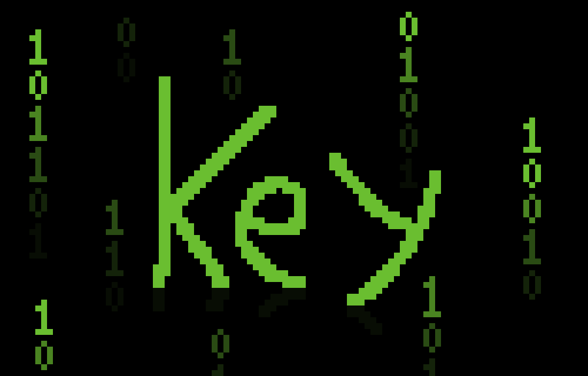

---

- 🔭 I’m currently working on 'unmake'
- 🌱 I’m currently learning [Rust](https://rust-lang.org)

My skills :sparkles:
---------------------

  <a href="https://skillicons.dev">
     
     
     
     
    
  </a>

Links 🔗
------

* GitHub: `https://github.com/keyhan-tiny112`
* PyPI: `https://pypi.org/user/keyhan_112`
* telegram: [`@keyhan_112`](https://t.me/keyhan_112)
* discord: `@key-112`
